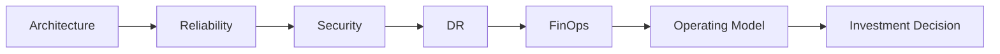

# Technical Due Diligence Matrix

This matrix helps teams assess cloud, SaaS, and platform risk in a structured diligence review.
It is the central table for summarizing material findings and their business implications.

## Purpose

Use this matrix to connect architecture, reliability, security, DR, FinOps, and modernization risk into one diligence output.

## Review Areas

### 1. Architecture Risk

- scalability
- dependency design
- platform complexity
- technical debt

### 2. Reliability Risk

- service availability
- incident maturity
- SLO discipline
- ownership clarity

### 3. Security and Compliance Risk

- baseline controls
- data handling
- access management
- audit exposure

### 4. DR and Resilience Risk

- RTO/RPO realism
- recovery testing
- failover readiness
- backup coverage

### 5. FinOps and Cost Risk

- spend concentration
- allocation quality
- commitment risk
- cost transparency

### 6. Operating Model Risk

- ownership clarity
- review cadence
- change discipline
- escalation path

## Example Matrix

| Area | Risk Level | Finding | Action |
| --- | --- | --- | --- |
| Architecture | High | Fragile dependency chain | Redesign critical paths |
| Reliability | Medium | Incomplete SLO coverage | Define service targets |
| Security | High | Access controls need review | Complete security remediation |
| DR | Medium | Recovery testing inconsistent | Execute test plan |
| FinOps | Medium | Tagging gaps reduce visibility | Fix allocation model |

## Figure

## Recommended Actions

- separate critical findings from nice-to-have improvements
- assign each finding an owner and due date
- summarize the investment impact clearly
- use the matrix to drive remediation sequencing
- flag any finding that changes the investment thesis or close plan

## Use

Use this page as the first place to summarize risk across domains before writing the executive report.

## Outcome

A strong diligence matrix makes it easier to separate major deal issues from background technical noise.

## Related Artifacts

- [Cloud Risk Assessment Template](../templates/cloud-risk-assessment-template.md)
- [Due Diligence Questionnaire](../templates/due-diligence-questionnaire.md)
- [Executive Summary Template](../templates/executive-summary-template.md)
- [Remediation Roadmap Template](../templates/remediation-roadmap-template.md)
