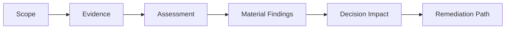

# Framework Overview

## What This Framework Does

This framework gives diligence teams a repeatable way to assess cloud and SaaS platforms before investment, acquisition, restructuring, or modernization.
It is a decision-support framework, not just an assessment checklist.
It helps teams explain what the findings mean for the deal, the program, or the operating model.
The framework is meant to make technical findings easier to compare across targets and easier to translate into action.

## Diligence Flow

## What It Covers

- architecture
- reliability
- security and compliance
- disaster recovery
- FinOps and cloud cost risk
- technical debt
- operating model maturity

## Who Uses It

- due diligence teams
- technical advisors
- architecture review boards
- private equity and investment teams
- executive sponsors

## What Good Looks Like

- risks are separated by domain
- findings are evidence-backed
- critical items are prioritized clearly
- remediation actions are sequenced
- leadership can see the investment implications
- assumptions are explicit
- weak evidence is called out clearly

## How To Read It

Start with the framework overview, then move into the domain assessments and scorecards.
That sequence keeps the review focused on material issues first and supporting detail second.

## Result

The framework helps teams compare targets more consistently and turn technical findings into a clear action path.

## Outputs

- diligence matrix
- risk scorecards
- executive summary
- remediation roadmap
- evidence notes

## Diligence Layers

| Layer | Question | Artifact |
| --- | --- | --- |
| Scope | What is being reviewed? | Due diligence questionnaire |
| Evidence | What supports the claim? | Evidence notes |
| Assessment | What is the current state? | Domain assessment |
| Decision | What matters to the deal? | Executive summary |
| Remediation | What happens next? | Remediation roadmap |

## Practical Use

Use this framework when you need a defensible view of platform health without overcomplicating the review process.

## Decision Rule

If a finding does not affect the investment view, operating risk, or remediation path, it should be treated as supporting detail rather than a core diligence issue.

## How To Read It

Start with the framework overview, then move into the domain assessments and scorecards.
That sequence keeps the review focused on material issues first and supporting detail second.

## Result

The framework helps teams compare targets more consistently and turn technical findings into a clear action path.
